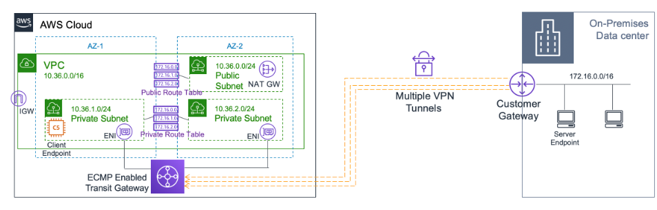

Kinesis Data Firehose

 
Amazon Kinesis Data Firehose is the easiest way to reliably load streaming data into data lakes, data stores, and analytics tools. It can capture, transform, and load streaming data into Amazon S3, Amazon Redshift, Amazon Elasticsearch Service, and Splunk, enabling near real-time analytics with existing business intelligence tools and dashboards you’re already using today. It is a fully managed service that automatically scales to match the throughput of your data and requires no ongoing administration.

Amazon EMR

 
Amazon EMR is the industry-leading cloud big data platform for processing vast amounts of data using open source tools such as Apache Spark, Apache Hive, Apache HBase, Apache Flink, Apache Hudi, and Presto. With EMR you can run Petabyte-scale analysis at less than half of the cost of traditional on-premises solutions and over 3x faster than standard Apache Spark. Amazon EMR uses Hadoop, an open-source framework, to distribute your data and processing across a resizable cluster of Amazon EC2 instances.

ASG

 
 

 
(ASG) is not terminating an unhealthy Amazon EC2 instance

  
  The health check grace period for the instance has not expired  
  The instance maybe in Impaired status - Amazon EC2 Auto Scaling does not immediately terminate instances with an Impaired status. 
  The instance has failed the ELB health check status - By default, Amazon EC2 Auto Scaling doesn't use the results of ELB health checks to determine an instance's health status when the group's health check configuration is set to EC2. 
 You are billed for instances as soon as they are launched, including the time that they are not yet in service.
 
 

RDS

 
RDS db instance, running as a multi-AZ deployment - performs synchronous data replication

Rekognition

makes it easy to add image and video analysis to your applications  
you can identify objects, people, text, scenes, and activities in images and videos, as well as detect any inappropriate content. Amazon Rekognition also provides highly accurate facial analysis and facial search capabilities that you can use to detect, analyze, and compare faces for a wide variety of user verification, people counting
 

Guardduty

Amazon GuardDuty is a threat detection service that continuously monitors your AWS accounts and workloads for malicious activity and delivers detailed
 
Amazon GuardDuty offers threat detection that enables you to continuously monitor and protect your AWS accounts, workloads, and data stored in Amazon S3. GuardDuty analyzes continuous streams of meta-data generated from your account and network activity found in AWS CloudTrail Events, Amazon VPC Flow Logs, and DNS Logs.

Macie

Macie is a data security service that uses machine learning (ML) and pattern matching to discover and help protect your sensitive data.
 

Inspector

Amazon Inspector is an automated vulnerability management service that continually scans AWS workloads for software vulnerabilities and unintended network exposure.
 

Amazon Comprehend

 
is a natural language processing (NLP) service that uses machine learning to find meaning and insights in text.
 
You can use Amazon Comprehend to determine the sentiment of a document. For example, you can use sentiment analysis to determine the sentiments of comments on a blog posting or a transcribed call to determine if your users loved or hated your content. You can determine sentiment for documents in any of the primary languages supported by Amazon Comprehend. All documents in one job must be in the same language.

Cognito

 
 Cognito is just a service for user authentication and authorization

AWS Backup 

 
 is a centralized backup service that makes it easy and cost-effective for you to backup your application data across AWS services in the AWS
 
WS Backup makes protecting your AWS storage volumes, databases, and file systems simple by providing a central place where you can configure and audit the AWS resources you want to backup, automate backup scheduling, set retention policies, and monitor all recent backup and restore activity.
 A company needs to use Amazon Aurora as the Amazon RDS database engine of their web application. The Solutions Architect has been instructed to implement a 90-day backup retention policy

AWS License Manager

 
is a service that makes it easier for you to manage your software licenses from software vendors (for example, Microsoft, SAP, Oracle, and IBM) centrally across AWS and your on-premises environments. 

Lambda

 
Lambda@Edge is a feature of Amazon CloudFront that lets you run code closer to users of your application, which improves performance and reduces latency. With Lambda@Edge, you don't have to provision or manage infrastructure in multiple locations around the world. You pay only for the compute time you consume 

S3

 
lifecycle policies 
 
Objects must be stored for at least 30 days in the current storage class before you can transition them to <b>STANDARD_IA or ONEZONE_IA</b>
 
This limitation does not apply to <b>INTELLIGENT_TIERING, GLACIER, and DEEP_ARCHIVE</b> storage class
 
 <b>Glacier Select</b> is incorrect because this is not a storage service. It is primarily used to run queries directly on data stored in Amazon Glacier, retrieving only the data you need out of your archives to use for analytics.

AWS Glue

 
It is a fully managed extract, transform, and load (ETL) service that makes it easy for customers to prepare and load their data for analytics.

Network Access Analyzer

 
Network Access Analyzer is a feature of VPC that reports on unintended access to your AWS resources based on the security and compliance that you set.
 This service is not capable of performing deep packet inspection on traffic entering or leaving your VPC, unlike AWS Network Firewall.

AWS Network Firewall

 
AWS Network Firewall is a stateful, managed, network firewall, and intrusion detection and prevention service for your virtual private cloud (VPC). 
 With Network Firewall, you can filter traffic at the perimeter of your VPC. This includes traffic going to and coming from an internet gateway, NAT gateway, or over VPN or AWS Direct Connect.
 
You can use Network Firewall to monitor and protect your Amazon VPC traffic in a number of ways, including the following:

- Pass traffic through only from known AWS service domains or IP address endpoints, such as Amazon S3.
- Use custom lists of known bad domains to limit the types of domain names that your applications can access.
- Perform deep packet inspection on traffic entering or leaving your VPC.
- Use stateful protocol detection to filter protocols like HTTPS, independent of the port used.

AWS Transit Gateway

 
With AWS Transit Gateway, you can simplify the connectivity between multiple VPCs and also connect to any VPC attached to AWS Transit Gateway with a single VPN connection. 
AWS Transit Gateway also enables you to scale the IPsec VPN throughput with equal-cost multi-path (ECMP) routing support over multiple VPN tunnels. A single VPN tunnel still has a maximum throughput of 1.25 Gbps. If you establish multiple VPN tunnels to an ECMP-enabled transit gateway, it can scale beyond the default limit of 1.25 Gbps.

AWS AppSync

 
AWS AppSync is a serverless GraphQL and Pub/Sub API service that simplifies building modern web and mobile applications. It provides a robust, scalable GraphQL interface for application developers to combine data from multiple sources, including Amazon DynamoDB, AWS Lambda, and HTTP APIs.

AWS CloudTrail

 
CloudTrail is primarily used to monitor and record the account activity across your AWS resources and not your web applications. You cannot use CloudTrail to capture the detailed information of all HTTP requests that go through your public-facing Application Load Balancer (ALB). CloudTrail can only track the resource changes made to your ALB, but not the actual IP traffic that goes through it.

CloudWatch Container Insights

 
 The primary function of CloudWatch Container Insights is to collect, aggregate, and summarize metrics and logs from your containerized applications and microservices.

Amazon CloudWatch Application Insights

 
Amazon CloudWatch Application Insights facilitates observability for your applications and underlying AWS resources. It helps you set up the best monitors for your application resources to continuously analyze data for signs of problems with your applications. Application Insights, which is powered by SageMaker and other AWS technologies, provides automated dashboards that show potential problems with monitored applications, which help you to quickly isolate ongoing issues with your applications and infrastructure. 

Amazon FSx 

 
Amazon FSx is a fully managed third-party file system solution. It uses SSD storage to provide fast performance with low latency.

Amazon FSx for Lustre

 
Amazon FSx for Lustre provides a high-performance file system optimized for fast processing of workloads such as machine learning, high performance computing (HPC), video processing, financial modeling, and electronic design automation (EDA). These workloads commonly require data to be presented via a fast and scalable file system interface and typically have data sets stored on long-term data stores like Amazon S3.
 
With Amazon FSx, you can launch and run a file system that provides sub-millisecond access to your data and allows you to read and write data at speeds of up to hundreds of gigabytes per second of throughput and millions of IOPS.
 

Amazon FSx for Windows File Server

 

A fully managed native Microsoft Windows file system with full support for the SMB protocol, Windows NTFS, and Microsoft Active Directory (AD) integration.

Amazon Lex

 
 A service that can help you build conversational interfaces using voice and text.
  
 Amazon Lex enables you to build applications using a speech or text interface powered by the same technology that powers Amazon Alexa. Amazon Lex provides the deep functionality and flexibility of natural language understanding (NLU) and automatic speech recognition (ASR), so you can build highly engaging user experiences with lifelike conversational interactions and create new categories of products.

simple

 

